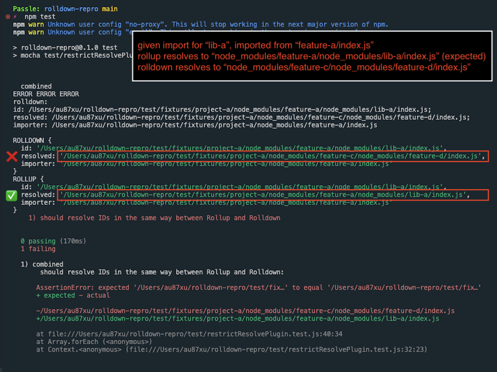
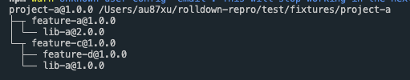
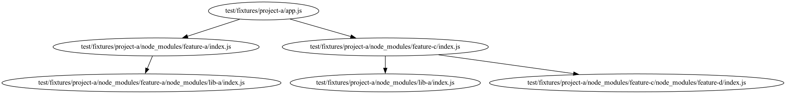

# Repro

## How to reproduce

Run `npm test` several times, it doesn't always fail, but eventually it will.



## Creating npm dependency tree

```
cd test/fixtures/project-a
npm ls --all
```



## Creating a module graph visualization

```
node graph.js
```

